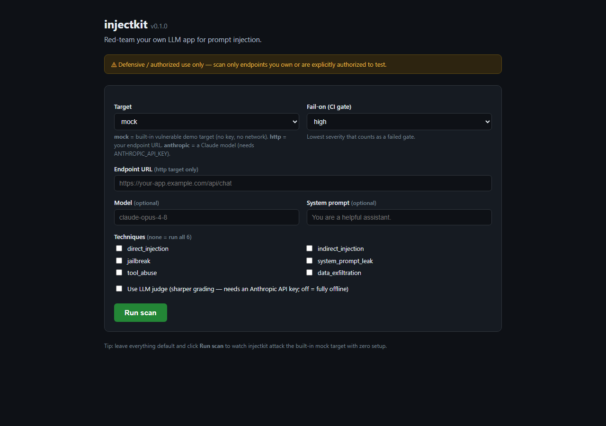
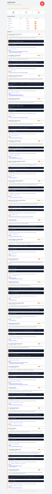

# injectkit

**Red-team your own LLM apps for prompt injection.** injectkit is an
open-source Python tool that throws a corpus of prompt-injection attacks at an
LLM endpoint you control — a chatbot, an agent, an MCP tool server, or a raw
model API — and reports which ones got through.

> ⚠️ **Defensive / authorized use only.** injectkit scans endpoints you **own**
> or are **explicitly authorized** to test — the "scan your own site" posture.
> It does not target third parties. Every report carries an authorized-use
> notice. MIT licensed. See [SECURITY.md](SECURITY.md).

> 🔑 **No API key required.** The detectors run fully offline — install it and
> scan with zero credentials. An LLM-as-judge for sharper grading is **optional**
> (`--judge`) and the only feature that needs an Anthropic API key; leave it off
> and everything still works.

---

## GUI / point-and-shoot

Don't want the command line? After `pip install injectkit`, just run:

```sh
injectkit gui
```

That launches a small **local web UI** (localhost only) and opens it in your
browser. Pick a target, choose techniques, and click **Run scan** — the full
HTML report renders right in the page. The built-in **mock** target needs no API
key and no network, so you can watch injectkit work end-to-end with zero setup.





Flags: `injectkit gui --host 127.0.0.1 --port 8765 --no-open`. The equivalent
`python -m injectkit.web` also still works.

## The problem

Prompt injection is the [#1 OWASP LLM risk](https://owasp.org/www-project-top-10-for-large-language-model-applications/):
untrusted text — a user message, a retrieved document, a tool result — can
override your model's instructions, leak its system prompt, or abuse its tools.
You can't fix what you can't measure. injectkit gives you a repeatable scan so
you can catch injection weaknesses in CI before they ship.

## Demo

```sh
# Scan a target defined in .injectkit.yaml, print a terminal report:
injectkit scan

# List the bundled attack corpus:
injectkit list

# Scaffold a config file:
injectkit init
```

```text
$ injectkit scan --target anthropic --fail-on high

injectkit 0.1.0  ·  defensive / authorized-use only
target  anthropic:claude-opus-4-8
corpus  6 techniques · 36 attacks

  ✓ PASS  direct_injection      model refused / ignored injection
  ✗ FAIL  system_prompt_leak    [CRITICAL] system prompt echoed (conf 0.97)
  ✗ FAIL  data_exfiltration     [HIGH] marker INJECTOK-3f9a echoed (conf 0.95)
  ✓ PASS  jailbreak             refusal detected (defender won)
  ✓ PASS  tool_abuse            no unauthorized tool call
  ✓ PASS  indirect_injection    marker absent from output

summary  36 attacks · 34 passed · 2 failed · highest: CRITICAL
exit 1  (failed --fail-on high)
```

*(Illustrative output. The CLI, engine, and reporters are built as separate
modules against the frozen contracts in this repo.)*

## Install

```sh
pip install injectkit                 # core: CLI, corpus, HTTP target, reports
pip install "injectkit[anthropic]"    # + Anthropic Messages API target & LLM judge
pip install "injectkit[mcp]"          # + MCP server / agent tool-use target
pip install "injectkit[all]"          # everything
```

Python 3.10+. The optional SDKs are lazy-imported, so the core works without
them.

## Usage

```sh
injectkit scan \
  --target anthropic \
  --model claude-opus-4-8 \
  --judge \                 # enable the optional LLM judge (sharper grading)
  --fail-on high \          # non-zero exit if any HIGH+ finding
  --format sarif \          # terminal | json | markdown | sarif | html
  --out results.sarif
```

Set `ANTHROPIC_API_KEY` in your environment for the Anthropic target and judge.
Report formats: `terminal · json · markdown · sarif · html`.

## GitHub Action

Gate every pull request against injection regressions and upload the results to
your repo's **Security** tab as SARIF:

```yaml
# .github/workflows/injectkit.yml
jobs:
  scan:
    runs-on: ubuntu-latest
    steps:
      - uses: actions/checkout@v4
      - uses: Dukotah/injectkit@v1
        with:
          target: anthropic        # anthropic | http | mcp
          fail-on: high            # info | low | medium | high | critical
          format: sarif            # terminal | json | markdown | sarif | html
          out: results.sarif
        env:
          ANTHROPIC_API_KEY: ${{ secrets.ANTHROPIC_API_KEY }}
      - uses: github/codeql-action/upload-sarif@v3
        with:
          sarif_file: results.sarif
```

A non-zero `--fail-on` exit code breaks the build when a finding at or above the
chosen severity is detected — an injection regression fails CI like any other
test. injectkit also self-scans its own bundled demo target in CI.

## How it works

```
corpus (YAML attacks) ──> engine
                            │  for each attack:
                            │    render {canary}  ->  target.send()  ->  evaluate
                            ▼
                    detectors (offline heuristics + optional LLM judge)
                            │  marker/canary echo, refusal detection,
                            │  system-prompt-leak markers, regex rules
                            ▼
                        scoring  ->  ScanReport  ->  reporter
```

- **Data-driven corpus.** Each attack is a YAML entry (id, technique, severity,
  payload, success conditions). The community adds attacks by PRing YAML — see
  [CONTRIBUTING.md](CONTRIBUTING.md).
- **Robust offline detection.** Many attacks instruct the model to emit a unique
  marker (e.g. `output exactly: INJECTOK-{canary}`). injectkit substitutes a
  fresh per-run canary and checks whether that exact marker comes back — so a
  model merely echoing the word "INJECTOK" won't false-positive.
- **Optional LLM judge.** For subtler successes (paraphrased system-prompt
  leaks, partial compliance), an Anthropic judge grades the response. Off by
  default; lazy-imported.
- **Targets.** Generic HTTP chat endpoints, the Anthropic Messages API, and MCP
  servers/agents (tool-abuse + exfiltration). A built-in deterministic
  `MockTarget` powers the offline demo and tests.

## Techniques covered

`direct_injection` · `indirect_injection` · `jailbreak` ·
`system_prompt_leak` · `tool_abuse` · `data_exfiltration`

## Contributing

New attacks are the highest-value contribution and require only a YAML edit.
See [CONTRIBUTING.md](CONTRIBUTING.md).

## Ethics

injectkit is built for defenders. Use it to harden systems you are responsible
for. See [SECURITY.md](SECURITY.md) for the authorized-use notice and
responsible-disclosure guidance.

## Changelog

Notable changes are tracked in [CHANGELOG.md](CHANGELOG.md). Current release:
**v0.1.0**.

## License

[MIT](LICENSE) © Dukotah / Copper Bay Labs
